##Tarea 1: Configuracion inicial
¿Que es un fork? Es una copia completa de un determinado repositorio (ejemplo práctica Lemoncode) en mi repositorio local (en mi caso githumb.com/franciscomelerolopez). Cualquier cambio no afecta al repositorio del cual hago la copia.
¿Que es upstream? Es una referencia para poder traernos cambios de ese repositorio (Lemoncode) en el caso de que haya una vez haya realizado el fork. es decir tener mi repositorio actualizado del originial.

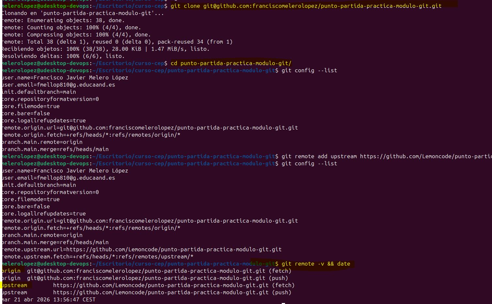
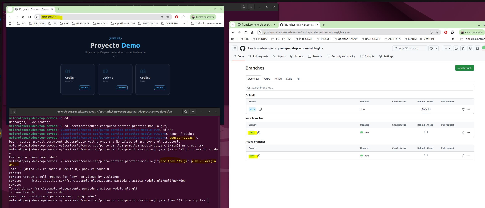

##Tarea 2. Feature branch A:

Se crea en otra rama ya que esos cambios son de un "extra" en el software que estamos realizando, ya que en main sólo contendrá código estable y probado, es decir cuando queramos que sea produccion
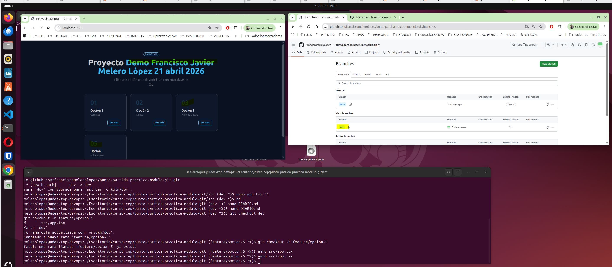
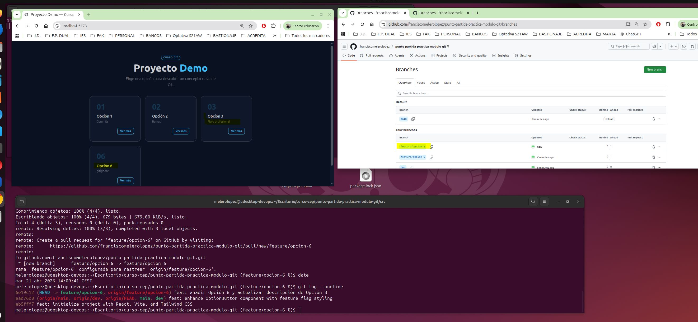

##Tarea 3. Feature branch B:

¿Que es un conflicto en Git? Cuando dos personas (o dos ramas) modifican una misma línea de un mismo archivo de forma distinta y cuando se mergean git no puede decidir automáticamente cual es la correcta, por tanto tendremos que hacerlo a mano, desde el editor.
¿Por qué se va a producir aquí? Aun no hemos mergeado, cuando lo hagamos en la rama dev, hemos tocado la línea sobre la opcion 3, en dos ramas diferentes. Esto se realizará en el siguiente ejercicio.

##Tarea 4.Pull Request

¿Que revisaste en la pestaña File Changed? En dicha pestaña he revisado que fuera correcto los cambios que voy a realizar y que las lines marcadas en rojo (cambio) /verde(nueva) es lo que quiero que se haga
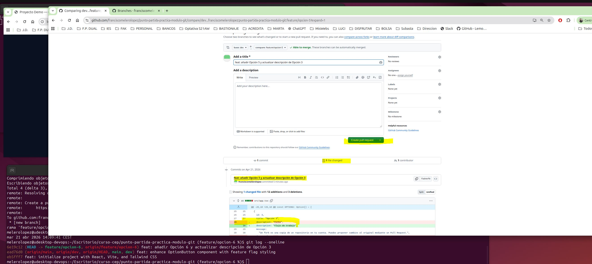
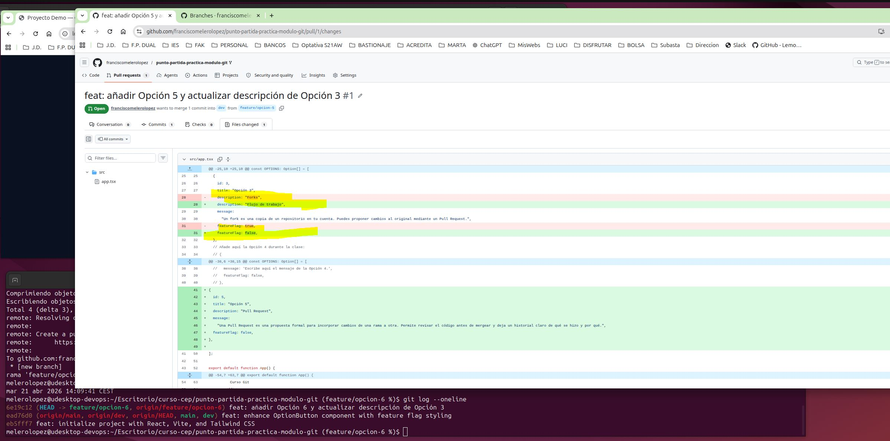
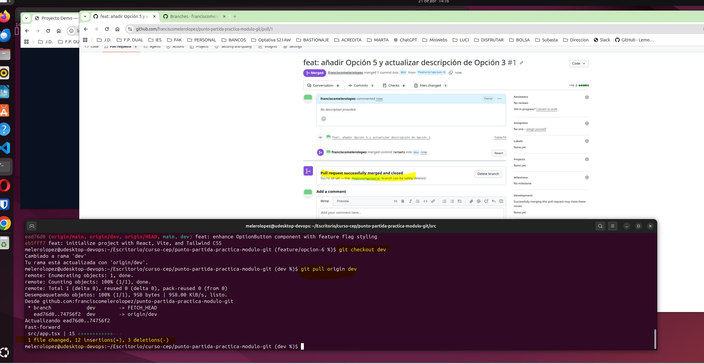

## Tarea 5. 
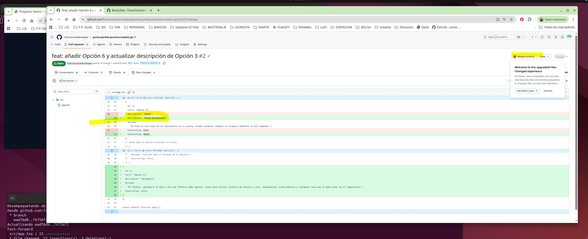
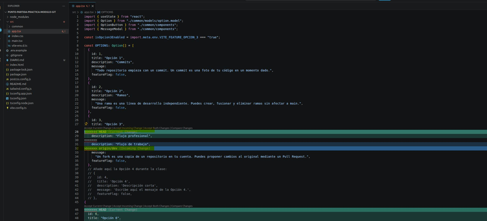
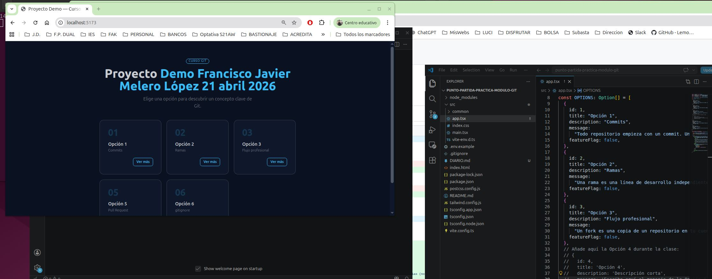
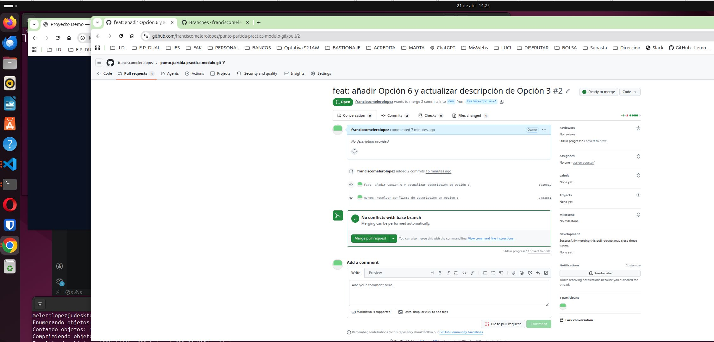
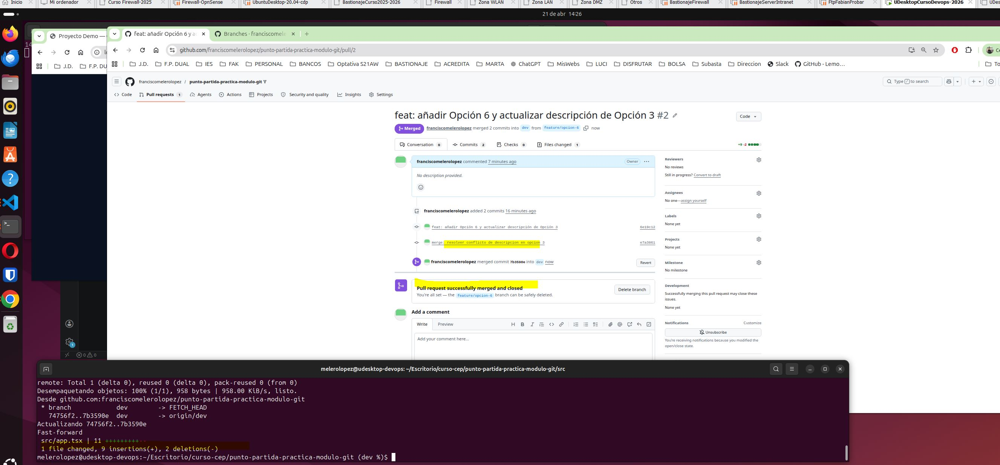

"<<<<<" Significa inicio del conflicto, en este caso en la Opcion3
"=====" Significa que todo lo que esté por delante de esto significa que es mi cambio y lo que esté detrás de otra reama que está intentando de traer.
">>>>>" Significa final del conflicto.

He borrado y he dejado la opción que me interesaba tal y como dice el ejercicio. yo he decidido. Hay un error con el title/description que he arreglado en esta (para no hacerlo de nuevo).

# Tarea 6
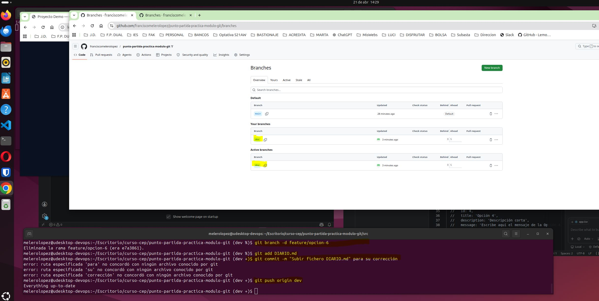
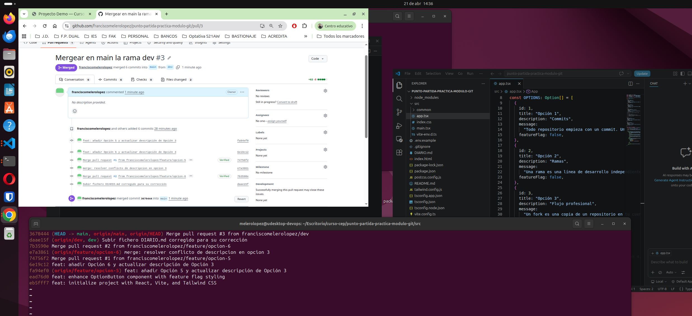
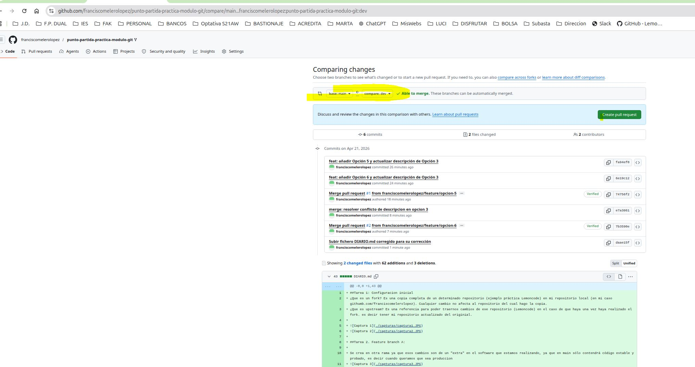
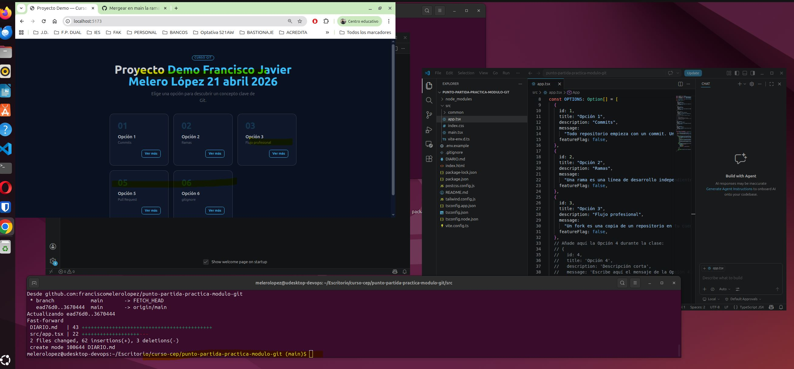

Hay otras capturas adicioonales que he creido conveniente subir
